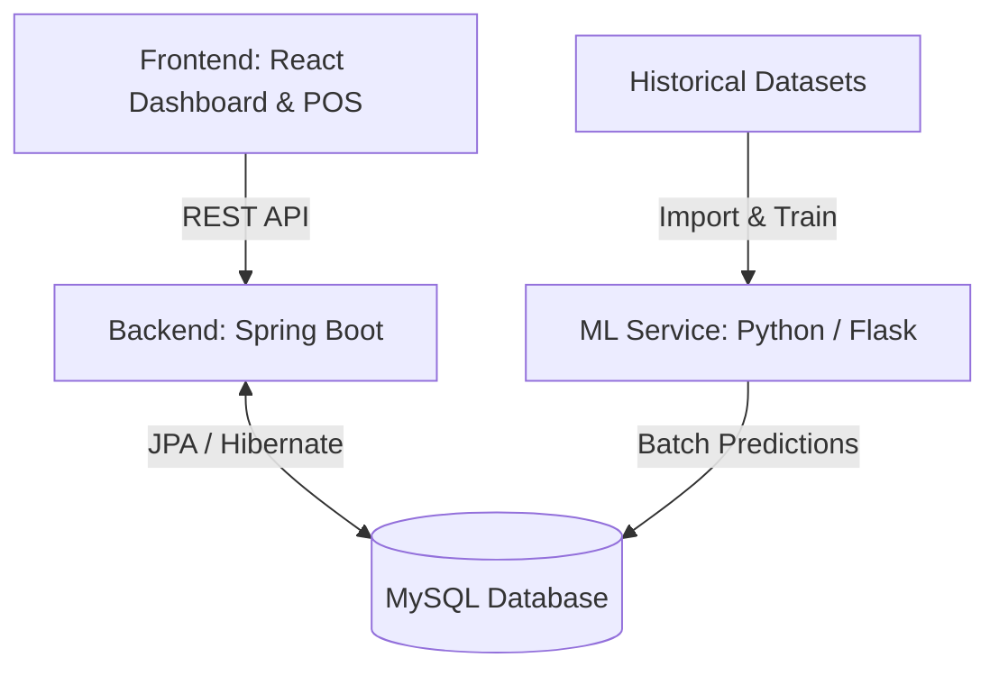

# 🍽️ AI-Powered Food Saving & Smart Billing System


> **From billing to intelligence** — An intelligent POS and restaurant management system that automatically reduces food waste through seamless AI integration.

---

## 🎯 Overview

Food waste is a major challenge for the restaurant industry, costing billions of dollars annually and severely impacting the environment. The **AI Food Saving & Smart Billing System** tackles this issue by silently learning from your restaurant's daily operations. 

Without requiring any machine learning expertise from restaurant staff, this system predicts future food demand, optimizes inventory, and recommends actionable steps to reduce food waste by up to **30%**.

## ✨ Key Features

- **🛍️ Smart Billing POS:** A fully functional React-based point-of-sale system for processing daily orders and updating inventory in real-time.
- **📈 Demand Forecasting:** Uses XGBoost models to predict exact quantities of menu items likely to be ordered on any given day based on historical trends, seasonality, and pricing.
- **🥬 Inventory Optimization:** Analyzes current stock, daily usage, and expiration data using Random Forest to predict waste percentages and recommend actions (e.g., "Discount", "Use Immediately").
- **📊 Real-time Dashboard:** Beautifully visualized analytics showing sales trends, demand predictions, and inventory alerts.
- **🔄 Asynchronous ML Integration:** The backend seamlessly integrates ML predictions via a shared database architecture, ensuring zero latency and high availability for the end-user.

---

## 🏗️ System Architecture

The project is built on a robust, decoupled architecture:



1. **Frontend (React)**: Handles user interaction, POS billing, and dashboard visualizations.
2. **Backend (Spring Boot)**: Manages business logic, authentication, order processing, and serves pre-computed ML predictions to the frontend.
3. **ML Engine (Python)**: Trains models on historical data and performs batch inference to populate the database with demand and waste predictions.
4. **Database (MySQL)**: The central source of truth linking the backend and the ML engine.

---

## 📂 Project Structure

```text
restaurant-ai-system/
├── frontend-react/          # React UI (Admin Dashboard, Billing POS)
├── backend-springboot/      # Spring Boot REST API (Controllers, Services)
├── ml-service-python/       # Python ML Service (Training, Inference, Flask)
└── database/                # SQL Schemas and Data Pipeline Scripts
```

---

## 🛠️ Technology Stack

| Layer | Technology |
| :--- | :--- |
| **Frontend** | React 18, HTML5, CSS3, Chart.js / Recharts |
| **Backend** | Spring Boot 3.2, Java 17, Spring Data JPA |
| **ML Engine** | Python 3.10+, Pandas, Scikit-learn, XGBoost |
| **Database** | MySQL 8.0 |
| **Security** | Spring Security, JWT (Planned) |

---

## 🚀 Getting Started

### Prerequisites
- **Java 17+**
- **Node.js 18+**
- **Python 3.10+**
- **MySQL 8.0+**

### 1. Database Setup
1. Create a MySQL database named `restaurant_ai_db`.
2. Run the schema creation script:
   ```bash
   mysql -u root -p restaurant_ai_db < database/schema.sql
   ```

### 2. Machine Learning & Data Pipeline
First, navigate to the ML service directory and install dependencies:
```bash
cd ml-service-python
pip install -r requirements.txt
```
Run the data import and preprocessing script to load historical datasets:
```bash
python ../database/import_and_preprocess.py
```
Generate ML predictions and populate the database:
```bash
python generate_predictions_db.py
```
*(Optional)* Start the live ML Flask API:
```bash
python app.py
```

### 3. Backend Setup
Navigate to the Spring Boot directory and start the server:
```bash
cd backend-springboot
mvn clean install
mvn spring-boot:run
```
The backend API will be available at `http://localhost:8080`.

### 4. Frontend Setup
Navigate to the React application, install dependencies, and start the development server:
```bash
cd frontend-react
npm install
npm start
```
The application UI will be available at `http://localhost:3000`.

---

## 🧪 Testing

The backend is fully tested using JUnit 5, Mockito, and MockMvc. To run the integration and unit test suite:
```bash
cd backend-springboot
mvn test
```

## 📝 Datasets Used
The system's ML models were trained and validated on:
- **Western Fast Food Transactions** (Sales Data Analysis)
- **Indian Street Food Transactions** (Balaji Fast Food Sales)
- **Restaurant Inventory (100 Days)** (Daily stock, usage, waste, supplier data)

---

## 📜 License
This project is intended for academic, research, and demonstration purposes.
